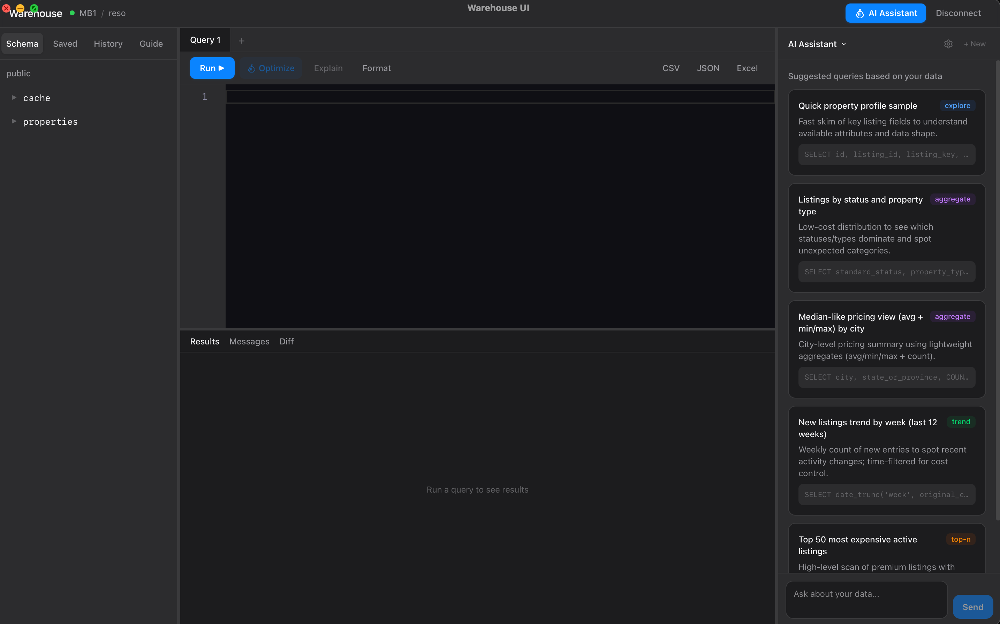
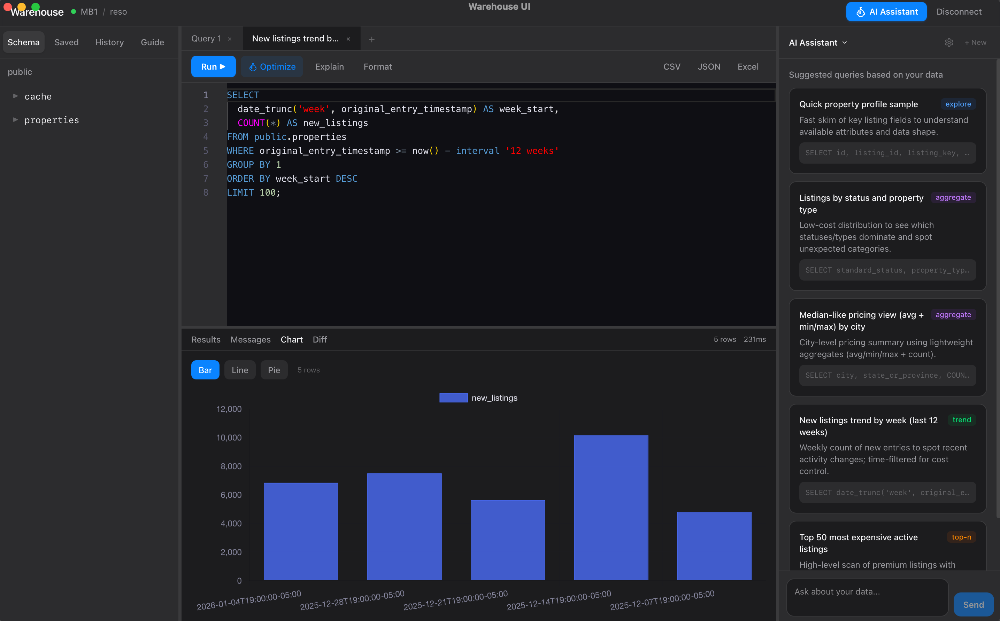
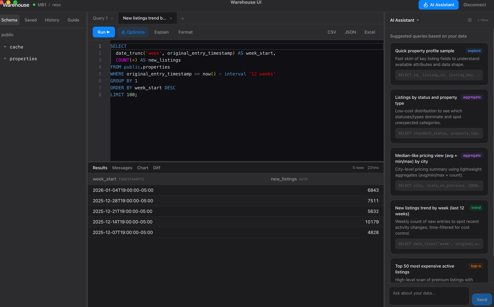

# Warehouse UI

**One app for all your databases.** Connect to BigQuery, PostgreSQL, MySQL, SQLite, and MongoDB from a single native desktop app. Browse schemas, write queries, visualize results, and let AI help you explore your data.



<p align="center">
  <a href="https://github.com/olegnazarov23/warehouse-ui/releases/latest"><strong>Download for macOS</strong></a> &nbsp;·&nbsp;
  <a href="https://github.com/olegnazarov23/warehouse-ui/releases/latest"><strong>Download for Windows</strong></a> &nbsp;·&nbsp;
  <a href="#build-from-source">Build from source</a>
</p>

---

## Why Warehouse UI?

Most teams juggle multiple database tools — pgAdmin for Postgres, BigQuery console in the browser, MongoDB Compass, separate SQL editors. Each with different shortcuts, different workflows, different limitations.

**Warehouse UI replaces all of them with one app that:**

- Connects to any database you use — no switching between tools
- Shows you what a query will cost before you run it (BigQuery dry-run)
- Has an AI assistant that actually understands your schema and codebase
- Runs natively on your desktop — not a slow Electron wrapper or browser tab
- Keeps your credentials encrypted and your data local

---

## Screenshots

### Query results with chart visualization
Run queries and instantly visualize results as bar, line, or pie charts.



### Sortable data grid
Column types, row counts, execution timing — all at a glance.



---

## Features

### Database & Connectivity
- **5 databases, one app** — BigQuery, PostgreSQL, MySQL, SQLite, MongoDB
- **SSH tunneling** — Connect through bastion hosts with key auth, ProxyJump, auto-resolved ~/.ssh/config
- **Schema browser** — Tree view with databases, tables, columns, types, and row counts
- **Auto-detect connections** — Scans .env files and Docker Compose, one-click Test & Add

### Query Editor
- **Monaco editor** — Syntax highlighting, schema-aware autocomplete, multi-tab, formatting
- **Cost projection** — Dry-run on BigQuery to see estimated cost, bytes, and referenced tables before execution
- **Query explain** — Visual execution plan tree (PostgreSQL, MySQL, SQLite)
- **SQL hints** — Static analyzer catches SELECT *, missing LIMIT, leading wildcards, implicit cross joins — no AI needed
- **MongoDB shell queries** — find, aggregate, countDocuments, distinct with automatic document-to-table flattening

### Results & Visualization
- **Chart panel** — Bar, line, and pie charts from query results with auto-detected axes
- **Virtual scrolling** — Handles 10k+ rows without lag
- **Inline cell editing** — Double-click cells to generate UPDATE queries
- **Data diff** — Compare two query results side-by-side with color-coded changes
- **Export** — CSV, JSON, and Excel (.xlsx) with native file dialogs

### AI Assistant
- **Pluggable LLM** — OpenAI, Anthropic, Ollama, or any local model (LM Studio, vLLM, llama.cpp)
- **Schema-aware** — Sees your tables, columns, current SQL, query results, and errors
- **Agentic tool-use** — AI actively searches your codebase, executes SQL, and analyzes execution plans during conversations
- **Deep codebase context** — Link local repos and the AI loads your models, services, and business logic to write the right query
- **Query optimizer** — One-click iterative optimization verified by dry-run
- **Multi-chat with memory** — Persistent conversations per connection with auto-generated titles
- **Auto-discovery** — One-click scan of all tables + AI-generated sample queries to get started fast

### Security & Privacy
- **Encrypted credentials** — API keys and passwords are AES-256-GCM encrypted at rest
- **Local-first** — No data leaves your machine unless you configure a cloud AI provider
- **Validated keys** — API keys tested before saving, never stored in plaintext

---

## Quick Start

### Download the app

| Platform | Download |
|----------|----------|
| macOS (Intel + Apple Silicon) | [warehouse-ui-macos-universal.dmg](https://github.com/olegnazarov23/warehouse-ui/releases/latest) |
| Windows (64-bit) | [warehouse-ui-windows-amd64-installer.exe](https://github.com/olegnazarov23/warehouse-ui/releases/latest) |

1. Install and launch
2. Add a database connection
3. Click the gear icon in the AI panel to configure your AI provider (optional)

### Build from source

**Prerequisites:** [Go 1.22+](https://go.dev/dl/), [Wails CLI](https://wails.io/docs/gettingstarted/installation), [Node.js 18+](https://nodejs.org/)

```bash
git clone https://github.com/olegnazarov23/warehouse-ui.git
cd warehouse-ui
cd frontend && npm install && cd ..

# Dev mode with hot reload
wails dev

# Production build
wails build
./build/bin/warehouse-ui
```

---

## AI Setup

Configure in-app via the gear icon — no config files needed.

| Provider | Models | Setup |
|----------|--------|-------|
| OpenAI | GPT-4o, o3, GPT-5 | API key |
| Anthropic | Claude Sonnet 4, Opus 4 | API key |
| Ollama | Llama 3, Qwen, DeepSeek, etc. | Local endpoint |
| Local (LM Studio, vLLM, llama.cpp) | Any model | Custom endpoint URL |

The AI sees your connected schema, current editor state, query results, and linked codebase. Link a local code repository and the AI loads your full source files — models, services, controllers — to understand your business logic and write accurate queries.

---

## Supported Databases

| Database | Cost Estimate | SSH Tunnel | Notes |
|----------|:---:|:---:|-------|
| BigQuery | $5/TB dry-run | — | Service account JSON, referenced tables |
| PostgreSQL | — | Yes | EXPLAIN row estimates, SSL |
| MySQL | — | Yes | EXPLAIN row estimates, SSL |
| SQLite | — | — | Pure Go, no CGO needed |
| MongoDB | — | Yes | Shell-style queries, document flattening |
| ClickHouse | Planned | — | Coming soon |

---

## Architecture

```
Go (Wails v2)           Svelte 5 + TailwindCSS 4
┌─────────────────┐     ┌─────────────────────────┐
│  app.go         │◄───►│  App.svelte              │
│  ├─ driver/     │     │  ├─ ConnectionPage       │
│  │  ├─ bigquery │     │  ├─ Shell (3-panel)      │
│  │  ├─ postgres │     │  │  ├─ Sidebar           │
│  │  ├─ mysql    │     │  │  │  ├─ SchemaTree     │
│  │  ├─ mongodb  │     │  │  │  ├─ SavedQueries   │
│  │  └─ sqlite   │     │  │  │  ├─ History        │
│  ├─ tunnel/     │     │  │  │  └─ Templates      │
│  │  └─ ssh      │     │  │  ├─ QueryEditor       │
│  ├─ store/      │     │  │  ├─ ResultsPanel      │
│  │  └─ sqlite   │     │  │  └─ DataGrid          │
│  └─ ai/         │     │  └─ AiPanel              │
│     ├─ openai   │     └─────────────────────────┘
│     ├─ anthropic│
│     └─ ollama   │
└─────────────────┘
        │                          │
        └──── Wails Bindings ──────┘
```

**Go backend** handles database connections, query execution, AI, code scanning, and export. Every public method on the `App` struct is available to the frontend via Wails bindings.

**Svelte frontend** is a 3-panel layout: schema sidebar, Monaco editor + results, and AI chat. All communication goes through generated Wails JS bindings.

**Embedded SQLite** (pure Go, no CGO) stores connections, history, saved queries, AI conversations, and settings. All sensitive data is encrypted.

---

## Contributing

1. Fork the repository
2. Create your feature branch (`git checkout -b feature/amazing-feature`)
3. Commit your changes
4. Push and open a Pull Request

## License

MIT
